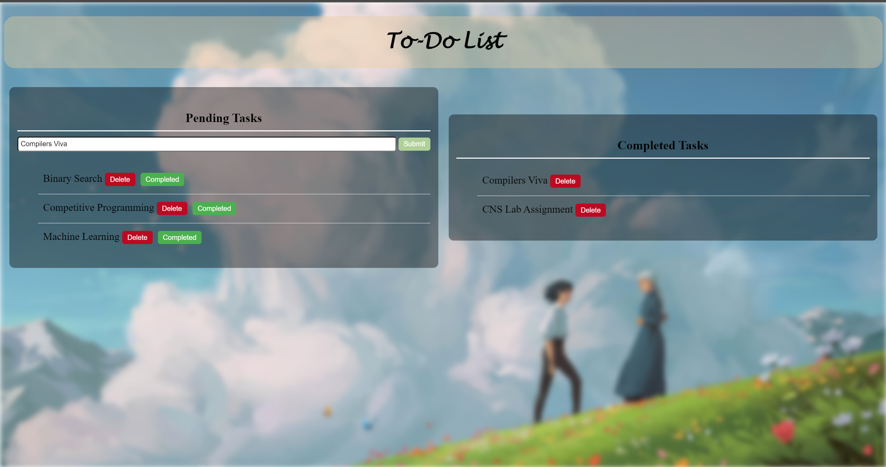

# To-Do List Project

A simple web-based to-do list application built using HTML, CSS, and JavaScript.



## Features

- Add new tasks to a pending tasks list.
- Mark tasks as completed and move them to a separate completed tasks list.
- Delete tasks from either the pending or completed tasks list.
- Responsive design suitable for desktop and mobile devices.

## Getting Started

### Prerequisites

- Web browser (Chrome, Firefox, Safari, etc.)

### Installation

1. Clone the repository:

    ```bash
    git clone https://github.com/your-username/to-do-list.git
    ```

2. Open `index.html` in your preferred web browser.

## Usage

1. Enter a task in the input field under "Pending Tasks" and press Enter or click the "Add Task" button.
2. To mark a task as completed, click the "Completed" button next to the task. The task will be moved to the "Completed Tasks" list.
3. To delete a task, click the "Delete" button next to the task in either the "Pending Tasks" or "Completed Tasks" list.

## Contributing

Contributions are welcome! If you'd like to contribute to this project, please follow these steps:

1. Fork the repository.
2. Create a new branch (`git checkout -b feature/your-feature-name`).
3. Make your changes.
4. Commit your changes (`git commit -am 'Add some feature'`).
5. Push to the branch (`git push origin feature/your-feature-name`).
6. Create a new Pull Request.

## Acknowledgments

- Inspiration: Microsoft To-Do Apps
